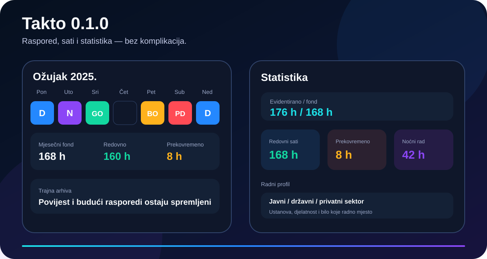

# Takto

<p align="center">
  
</p>

<p align="center">
  
</p>

> **Dodirni. Označi. Radi.**  
> Moderan Android planer rada i rasporeda za jasan pregled mjeseca, radnih sati, obveza i odsutnosti.


Takto je aplikacija za svakoga tko želi svoj radni mjesec razumjeti **na prvi pogled**. Velike kalendarske ćelije, vlastite oznake, radni sati, fond sati, podsjetnici, uzorci i statistika spojeni su u čisto svijetlo sučelje s visokim kontrastom i dosljednim izgledom na svim uređajima.

<p align="center">
  
</p>

## Zašto Takto

**Planiraj bez tablica i papira.** Dodirni datum i odaberi oznaku ili upiši vlastitu. Radni dan, obveza, odsutnost, edukacija, teren ili bilo koji drugi unos sprema se u nekoliko sekundi.

**Vidi cijeli mjesec odjednom.** Kalendar koristi velike obojene ćelije i dosljedan sustav boja: plava, ljubičasta, zelena, jantarna i crvena. Prazna ćelija znači da za taj dan nema spremljenog unosa.

**Prati stvarno radno vrijeme.** Za svaki radni unos moguće je spremiti početak, kraj i pauzu. Takto računa trajanje, redovne i prekovremene sate, noćni rad, subotu, nedjelju i rad na hrvatske blagdane.

**Prilagodi aplikaciju svom poslu.** Oznake, boje, vlastite brze oznake, predlošci radnog vremena i ponavljajući uzorci mogu se prilagoditi korisniku.

**Podaci ostaju lokalni.** Takto ne deklarira INTERNET dopuštenje. Raspored se sprema lokalno kroz trajni append-only journal i periodične atomske checkpoint snimke, uz pričuvnu recovery kopiju. Male izmjene zato ne prepisuju cijeli višegodišnji raspored, a izvoz se pokreće samo kada korisnik to zatraži.

---

## Ključne mogućnosti

### Kalendar koji radi jednim dodirom

- Početna je sažeti dashboard za današnji unos i mjesečni fond bez dugog vertikalnog feeda
- puni Kalendar, Statistika, Uzorci i Postavke ostaju u zasebnim donjim karticama
- početna kartica **Danas** omogućuje dodavanje najrelevantnije oznake jednim dodirom
- brze akcije i mjesečne metrike automatski se preslaguju na uskim ekranima i pri velikom fontu
- cijeli spremljeni današnji unos ima objedinjeni TalkBack opis s datumom, oznakom, radnim vremenom, trajanjem i napomenom
- preporuke oznaka uzimaju u obzir i učestalost i svježinu stvarnog korištenja
- veliki mjesečni pregled 6 × 7
- odabir oznaka u Kalendaru automatski prelazi u jedan stupac na uskim ekranima ili pri velikom fontu
- alatna traka Kalendara automatski prelazi u dva retka na uskim ekranima i pri povećanom fontu kako akcije ne bi bile odrezane
- naslov mjeseca u Kalendaru eksplicitno je izložen kao gumb za odabir drugog mjeseca radi bolje TalkBack navigacije
- polja početka i kraja rada slažu se vertikalno kada bi dva stupca bila pretijesna
- vlastiti izbor boje koristi pristupačne 48 dp kontrole, a tekst automatski bira svijetlu ili tamnu boju prema kontrastu
- prilagodljivi brzi odabir koji prioritizira nedavno korištene oznake
- ugrađene oznake **D, N, J, GO, SD, BO i PD** imaju zasebne početne boje
- **D** i **N** su prve početne brze oznake na novoj instalaciji
- vlastiti tekst, naziv i boja
- vlastite oznake automatski ulaze u brzi odabir
- sve nepoznate kratice iz CSV uvoza automatski se čuvaju kao vlastite brze oznake
- napomena za svaki datum
- današnji datum i aktivni datum jasno istaknuti
- TalkBack opis datuma, oznake, napomene i radnog vremena

### Brzo uređivanje rasporeda

- navigacija do mjeseca **100 godina unatrag i 100 godina unaprijed**
- nema automatskog brisanja starih ni budućih rasporeda
- atomska glavna snimka rasporeda
- pričuvna recovery snimka posljednjeg potvrđenog stanja
- append-only lokalna arhiva svake promjene rasporeda
- automatski oporavak nedovršene zadnje promjene iz revizijske arhive
- jednokratna migracija starog SharedPreferences rasporeda bez gubitka podataka
- višestruki odabir više datuma
- prečaci **Cijeli mjesec** i **Pon–pet**
- bulk dodjela oznaka
- bulk postavljanje radnog vremena
- kopiranje i lijepljenje cijelog tjedna
- Undo / Vrati zadnju promjenu
- potvrde prije destruktivnih radnji poput brisanja dana, više dana, uzorka ili predloška vremena
- pametna pretraga po oznaci, nazivu, napomeni, datumu i radnom vremenu
- pretraga ignorira dijakritičke znakove te podržava izraze **danas**, **sutra**, **jučer**, **prekosutra** i **prekjučer**
- hrvatski nazivi mjeseci, mjesec + godina i dani u tjednu mogu se pretraživati, npr. **listopad 2026** ili **petak**
- početak i kraj rada mogu se pronaći izravno upitom poput **07:00**
- filtri pretrage: **Danas**, **Buduće**, **S vremenom** i **S napomenom**, uz iste semantičke izraze i kao tekstualne upite
- hrvatski datumi poput `02.10.2026.` mogu se izravno pretraživati
- sistemska tipka Back iz sekundarnih odjeljaka prvo vraća na Početnu

### Radni sati i fond

- mjesečni fond sati
- redovni odrađeni sati
- potvrđeni prekovremeni sati po pojedinom radnom danu, odvojeni od redovnih sati
- brzi unos potvrđenih prekovremenih: 0 / 30 / 60 / 120 min
- zasebna kontrolna metrika rada iznad standardnog dana i mjesečnog fonda
- početak i kraj radnog unosa uz unos poput **07:30**, **7.30** ili **730**
- početno vrijeme za **D** je **07:00–19:00**, a za **N** **19:00–07:00** — obje smjene traju 12 sati i mogu se prilagoditi
- pauza u minutama s brzim izborom 0 / 15 / 30 / 45 / 60
- stroga provjera da pauza ne može biti dulja od samog radnog raspona
- radni unosi preko ponoći uz jasnu oznaku završetka sljedeći dan
- standardni dnevni fond
- automatski mjesečni fond pon–pet uz automatsko izuzimanje hrvatskih blagdana
- ručni fond po mjesecu
- prekovremeni sati
- noćni rad 22:00–06:00
- subota, nedjelja i rad na blagdan
- prosječno trajanje evidentiranog radnog unosa

### Uzorci

Takto može spremiti ponavljajuće cikluse, primjerice:

```text
D, D, N, N, -, -, -, -
```

`-` znači da taj dan ostaje bez unosa. Vizualni graditelj nudi najrelevantnije korisničke oznake kao brze korake, a početni prijedlozi uzoraka dinamički se grade iz stvarne uporabe umjesto fiksnih D/N rotacija. Uzorci se mogu primijeniti na veći raspon dana uz izbor hoće li postojeći unosi biti sačuvani ili prepisani.

### Radni profil

U postavkama se može spremiti osobni radni profil koji ostaje na uređaju:

- ime i prezime
- sektor
- djelatnost / industrija
- vrsta ustanove
- naziv ustanove ili poslodavca
- radno mjesto / pozicija
- prijedlozi za javni sektor, državni sektor, javne i državne ustanove, zdravstvo, obrazovanje, policiju, pravosuđe, vatrogastvo, komunalne službe i druga područja
- potpuno slobodan unos za ustanove i radna mjesta koja nisu na popisu

Početna koristi ime iz profila za osobni pozdrav i sažet dashboard bez mini-kalendara i dugog feeda, dok backup čuva i profil zajedno s rasporedom i postavkama.

### Plaća i koeficijenti

- obračun za državne i javne službe koristi provjerljive osnovice 2026. kada su primjenjive
- pretraživ katalog radnih mjesta i koeficijenata prenesen je iz projekta **bren-wp/RASPORED**
- katalog uključuje odabrana radna mjesta u zdravstvu, školstvu, državnoj službi i policiji
- odabrani koeficijent može se ručno korigirati; katalog nije zamjena za službeni akt konkretnog poslodavca
- dodan je i pretraživ referentni katalog poreznih lokaliteta 2026.; izbor mjesta automatski popunjava nižu i višu stopu
- porezne stope se i dalje mogu ručno promijeniti kada se na korisnika primjenjuje drugačija stopa
- za ostale sustave ostaje ručni unos bez izmišljanja osnovice ili dodataka
- Takto ne prikazuje potpunu procjenu neta dok nisu uneseni nužni porezni i obračunski podaci

### Podsjetnici

- dnevni podsjetnik rasporeda
- poseban podsjetnik prije početka rada
- podesivi odmak prije rada
- ponovno zakazivanje nakon restarta uređaja, promjene vremena ili vremenske zone
- dodir obavijesti vodi izravno na konkretan datum

### Statistika

- ukupni broj unosa i dana bez unosa
- dinamička raspodjela svih ugrađenih i vlastitih oznaka
- adaptivni grafovi koji prate stvarni način korištenja bez lažnih stupaca za nulte vrijednosti
- jasna prazna stanja kada godina nema unosa ili evidentiranih radnih sati
- pristupačni godišnji stupci s TalkBack opisima
- radni sati
- fond i razlika
- prekovremeni sati
- noćni, subotnji, nedjeljni i blagdanski sati
- mjesečni i godišnji pregled
- procjena isplate na Početnoj kada su podaci za obračun potpuni
- raspodjela po vlastitim oznakama

### Skeniranje, uvoz, izvoz i sigurnosna kopija

- skeniranje rasporeda kamerom uz ručno označavanje samo svojeg retka prije prepoznavanja
- precizno pomicanje područja gore/dolje/lijevo/desno, promjena veličine preko rubova i kutova te rotacija u oba smjera
- izdvajanje samo imenovane osobe iz rasporeda s više zaposlenika
- ručni odabir i obavezna potvrda mjeseca kada mjesec nije pronađen na slici
- uvoz fotografije rasporeda iz galerije uz veću rezoluciju za sitniji tekst u tablicama
- lokalno prepoznavanje datuma, oznaka i radnog vremena uz blokiranje dvosmislenih rezultata
- pregled svih pronađenih dana te uređivanje ili uklanjanje svakog unosa prije konačnog uvoza
- skener unaprijed prikazuje koliko je datuma novo, a koliko već popunjeno
- postojeći datumi se po zadanim postavkama ne prepisuju; destruktivno prepisivanje traži dodatnu potvrdu
- skenirane oznake koriste automatski čitljiv tekst i kod vrlo svijetlih vlastitih boja
- automatski unos potvrđenog rasporeda u Kalendar
- CSV izvoz
- CSV uvoz sa zarezom ili točka-zarezom
- hrvatski i ISO datumi
- JSON sigurnosna kopija i povrat
- iCalendar `.ics` izvoz
- dijeljenje rasporeda kroz Android Share
- očuvanje boja, napomena i radnog vremena

---

## Vizualni identitet

Takto koristi jedan produkcijski **svijetli** vizualni sustav. Tamni i sistemski način uklonjeni su kako bi kontrast, raspored i QA bili predvidljivi na svim uređajima.

| Element | Boja |
| --- | --- |
| Pozadina | `#F3F6F9` |
| Površina kartice | `#FFFFFF` |
| D / dnevna smjena | `#2563EB` |
| N / noćna smjena | `#7C3AED` |
| J / jutarnja smjena | `#0891B2` |
| GO / godišnji odmor | `#16A34A` |
| SD / slobodan dan | `#64748B` |
| BO / bolovanje | `#F59E0B` |
| PD / plaćeni dopust | `#DC2626` |

Dizajn nije statična slika. Svi glavni elementi iz referentnih vizuala implementirani su stvarnim Jetpack Compose komponentama: onboarding, početni pregled, veliki kalendar, brzi unos, statistika, uzorci, personalizacija i donja navigacija.

---

## Tehnologija

Takto 0.1.18 koristi aktualni stabilni Android toolchain:

- **Kotlin 2.4.20**
- **Android Gradle Plugin 9.4.1**
- **Gradle 9.8.0**
- **Jetpack Compose BOM 2026.09.00**
- **Material 3**
- **AndroidX Core 1.19.1**
- **Activity Compose 1.13.0**
- **Lifecycle 2.11.0**
- **compileSdk 37.1 — Android 17 SDK**
- **targetSdk 37 — Android 17**
- **minSdk 26 — Android 8.0**
- **Java 17**

Aplikacija je pisana u Kotlinu i Jetpack Composeu bez WebView sloja i bez INTERNET dopuštenja.

---

## Build, APK i AAB

GitHub Actions pri svakom pull requestu prema `main` izvodi:

1. strogi `dead_code_audit.py --strict`
2. `testDebugUnitTest`
3. `lintDebug`
4. `lintRelease`
5. `assembleDebug`
6. `assembleRelease`
7. `bundleRelease`
8. provjeru da APK i AAB datoteke stvarno postoje i nisu prazne
9. SHA-256 izračun za sve build artefakte

Nakon uspješnog workflowa dostupni su Actions artefakti:

- **Takto-0.1.18-debug-apk** — instalabilni debug APK
- **Takto-0.1.18-release-apk-unsigned** — optimizirani release APK bez produkcijskog potpisa
- **Takto-0.1.18-release-aab-unsigned** — release Android App Bundle
- **Takto-0.1.18-SHA256** — checksum datoteka

> Za objavu na Google Playu release AAB mora biti potpisan trajnim produkcijskim ključem. Ključ se namjerno ne pohranjuje u repozitorij.

Kada se u `main` spoji stvarna nova verzija, release workflow čita `versionName`, ponovno pokreće testove i lint, gradi APK/AAB, provjerava izlazne datoteke i automatski objavljuje odgovarajući `vX.Y.Z` GitHub Release. Ako izdanje već postoji, workflow ga ne duplicira.

## Privatnost i sigurnost

- nema INTERNET dopuštenja
- raspored i profil pohranjuju se lokalno
- veliki raspored više se ne sprema kao jedan SharedPreferences string
- glavna snimka koristi Android AtomicFile zapis kako prekid procesa ne bi ostavio napola zapisanu datoteku
- prije zamjene glavne snimke zadržava se pričuvna recovery kopija
- svaka promjena rasporeda ulazi u append-only lokalnu arhivu
- checkpoint sprema i sigurni byte-offset pa se pri pokretanju može izravno otvoriti samo rep arhive noviji od spremljene snimke
- ako offset nije valjan ili je snapshot starijeg formata, automatski se koristi kompatibilni fallback prema broju revizija
- broj revizija i duljina arhive cacheiraju se kao dodatna zaštita od nepotrebnog punog prebrojavanja journala
- konfliktni stariji zapis iz arhive ne prepisuje divergentno novije lokalno stanje
- stari i budući rasporedi ne brišu se automatski
- notification permission traži se samo na Androidu 13+
- datoteke se izvoze kroz Androidov sustav za datoteke/dijeljenje
- CSV i backup uvoz imaju strogo ograničenje veličine prije potpune alokacije sadržaja
- CSV redci obrađuju se sekvencijalno radi manje vršne potrošnje memorije
- trajna arhiva izvozi se streaming načinom izravno u odabranu datoteku
- JSON backup koristi verzioniranu shemu
- neispravni zapisi ne smiju srušiti aplikaciju
- produkcijski ključ za potpisivanje nikad ne smije biti u Git repozitoriju

---

## Verzija 0.1.10

Verzija **0.1.10** poboljšava Statistiku. Mjeseci s nulom više ne izgledaju kao da imaju podatak, godine bez podataka imaju jasno prazno stanje, a trajanja kraća od sata više se ne prikazuju kao 0h. Ključne metričke kartice i donut graf prilagođavaju se uskim ekranima, dok godišnji stupci imaju preciznije TalkBack opise.

## Licenca

MIT — vidi `LICENSE`.
